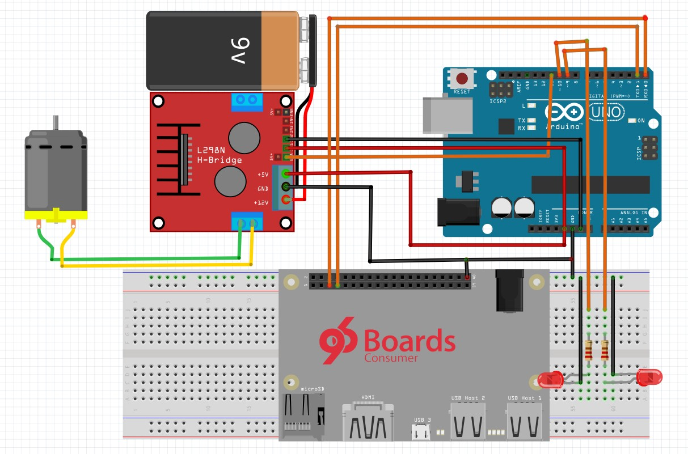

# AGL demo for 96Boards

This repository consists of [AGL](https://www.automotivelinux.org/) demos on
Dragonboard410c.

List of demos:
- [1) HVAC Demo](#1-hvac-demo)
- [2) Demo Application](#2-demo-application)

# 1. HVAC Demo

HVAC (Heat Ventilation and Air Control) demo focussed on demostrating the HVAC
GUI present in [AGL]() demo platform. This
involves controlling the fan speed and temperature. 

For demonstration purposes, default HVAC GUI is modified as below:

1. Controlling Fan Speed
2. Controlling Left temperature - Controlling Light intensity
3. Controlling Right temperature - Controlling Light intensity

## Table of Contents
- [1) Hardware](#1-hardware)
   - [1.1) Hardware Requirements](#11-hardware-requirements)
- [2) Software Setup](#2-software-setup)
   - [2.1) Arduino](#21-arduino)
   - [2.2) Dragonboard410c](#22-dragonboard410c)
- [3) Hardware Setup](#3-hardware-setup)
- [4) HVAC Demo](#4-hvac-demo)
- [5) Video Demonstration](#5-video-demonstration)

## 1) Hardware

### 1.1) Hardware Requirements

- [Dragonboard410c](https://www.96boards.org/product/dragonboard410c/)
- [96Boards Compliant Power Supply](http://www.96boards.org/product/power/)
- [Linksprite 96Boards Touch Screen](https://www.arrow.com/en/products/96boards-display-7/linksprite-technologies-inc)
- [Sensors Mezzanine](http://www.96boards.org/product/sensors-mezzanine/)
- [Arduino Uno](https://www.seeedstudio.com/Arduino-Uno-Rev3-p-2995.html)(Optional)
- [DC motor with Propellers](https://www.amazon.com/Piece-Propeller-Motor-Brushed-Small/dp/B00U53SGRQ)
- [L298 Motor Driver](https://www.amazon.com/Controller-Module-Bridge-Stepper-Arduino/dp/B00HNHUYSG)
- [5mm LED's](https://www.sparkfun.com/products/9590)
- 330 ohm resistors
- Connecting wires

>Note: It is assumed that Sensors Mezzanine is placed on top of Dragonboard410c

## 2) Software Setup

### 2.1) Arduino

Controlling Fan Speed and LED intensity are handled by the Arduino. Sensors
Mezzanine has an ATMega328 microcontroller comaptible with Arduino Uno. You
can use that or any external Arduino Uno for PWM control.

In case of using Sensors Mezzanine, the sketch can be uploaded by using Dragonboard410c
itself. For more info, see [here](https://www.96boards.org/blog/use-arduino-ide-sensors-mezzanine-board-linux/).

Following are the steps for getting the required arduino sketch: 
> If using Sensors Mezzanine, please follow the below steps on Dragonboard410c
running Debian otherwise use Arduino IDE on the host system for programming.

```shell
$ cd ~/Documents
$ git clone https://96boards-projects/agl-demo.git
$ cd agl-demo/arduino/hvac
```
Now open the `hvac.ino` using Arduino IDE and flash it onto the Sensors
Mezzanine or Arduino Uno.

### 2.2) Dragonboard410c

***Execution environment: Host PC***

#### Software Dependencies:
```shell
$ sudo apt-get install gawk wget git-core diffstat unzip texinfo gcc-multilib \
     build-essential chrpath socat libsdl1.2-dev xterm cpio curl
```
#### Downloading AGL Source Code

AGL uses [repo](https://source.android.com/source/using-repo) tool for maintaining
repositories. We need to download the source on the host machine and cross compile
it for Dragonboard410c.

```shell
$ export AGL_TOP=$HOME/workspace_agl
$ mkdir -p $AGL_TOP
$ mkdir -p ~/bin
$ export PATH=~/bin:$PATH
$ curl https://storage.googleapis.com/git-repo-downloads/repo > ~/bin/repo
$ chmod a+x ~/bin/repo
```
Next, download the stable branch of AGL.

```shell
$ cd $AGL_TOP
$ repo init -b dab -m dab_4.0.2.xml -u https://gerrit.automotivelinux.org/gerrit/AGL/AGL-repo
$ repo sync
```
> Note:
> 1. As of writing latest stable branch of AGL is 4.0.2. Always download the most recent stable release.
> 2. Replace AGL_TOP with the top level directory of cloned AGL source.

#### Building AGL

Now, build the **agl-demo-platform** for Dragonboard410c.

```shell
$ source meta-agl/scripts/aglsetup.sh -m dragonboard-410c agl-demo  agl-appfw-smack  agl-devel  agl-netboot
```
Now move to the directory where you have cloned the `agl-demo` project from 96Boards Projects Org.

```shell
$ cd agl-demo
```
Copy the custom HVAC recipie to AGL source

```shell
$ cp hvac_git.bb $(AGL_TOP)/meta-agl-demo/recipes-demo-hmi/hvac/hvac_git.bb
```
Execute `bitbake` command by moving to the build directory of AGL source.

```shell
$ cd $(AGL_TOP)/build
$ bitbake agl-demo-platform
```
> Note: Replace AGL_TOP with the top level directory of cloned AGL source

Build will take quite some time depending upon the host machine configuration.

#### Flashing AGL onto Dragonboard410c

Once the build has been completed, we have to flash the boot and rootfs images onto Dragonboard410c.
Now, boot Dragonboard into fastboot mode by following the instructions [here](https://github.com/96boards/documentation/blob/master/ConsumerEdition/DragonBoard-410c/Installation/LinuxFastboot.md).
Then follow the below instructions to flash AGL onto Dragonboard410c.

```shell
$ cd $AGL_TOP/build/tmp/deploy/images/dragonboard-410c
$ sudo fastboot flash boot boot-dragonboard-410c.img
$ sudo fastboot flash rootfs agl-demo-platform-dragonboard-410c.ext4
```
Once flash has been completed. Proceed to the below sections to execute HVAC demo.

## 3) Hardware Setup



- Make sure the Dragonboard410c is powered off
- Connect DC motor and LEDs to Arduino as per above schematic
- Connect LCD to Dragonboard410c via HDMI cable for display and Micro USB cable for touch input
- Power on your 96Boards CE with compatible power supply
- Dragonboard410c should now boot into AGL and homescreen should be visible.

> Note:
> 1. If you are using Arduino on Sensors Mezzanine, no need to connect RX/TX lines and
     5v line from motor driver.

## 4) HVAC Demo

***Execution environment: Dragonboard410c***

Navigate to the HVAC application from the Homescreen.

1. To control the Fan speed, change the position of the slider at the top.
2. To control the LED intensities, change the values of L/R temperatures by dragging up
   the `LO` box.
   
## 5) [Video Demonstration](https://www.youtube.com/watch?v=SEFfAzyVADc)

# 2. Demo Application

A demo Qt application which displays temperature data from TMP007 recursively at 3 seconds interval.
This demo can be used as a template for developing applciations using AGL framework.

## Table of Contents
- [1) Hardware](#1-hardware)
   - [1.1) Hardware Requirements](#11-hardware-requirements)
- [2) Software Setup](#2-software-setup)
   - [2.1) SDK Environment](#21-sdk-environment)
- [3) Hardware Setup](#3-hardware-setup)
- [4) Demo Application](#4-demo-applcation)

## 1) Hardware

### 1.1) Hardware Requirements

- [Dragonboard410c](https://www.96boards.org/product/dragonboard410c/)
- [96Boards Compliant Power Supply](http://www.96boards.org/product/power/)
- [Linksprite 96Boards Touch Screen](https://www.arrow.com/en/products/96boards-display-7/linksprite-technologies-inc)
- [Sensors Mezzanine](http://www.96boards.org/product/sensors-mezzanine/)
- [TMP007 Sensor](https://learn.adafruit.com/adafruit-tmp007-sensor-breakout/overview)

## 2) Software Setup

Boot agl-demo-platform on Dragonboard410c as mentioned in [HVAC Demo](https://github.com/96boards-projects/agl-demo#22-dragonboard410c).

### 2.1) SDK Environment

Set up the SDK environment for building AGL applications by following this [guide](http://docs.automotivelinux.org/docs/getting_started/en/dev/reference/setup-sdk-environment.html).

## 3) Hardware Setup

* Make sure the Dragonboard410c is powered off
* Connect Linksprite Touch Screen
* Connect Sensors Mezzanine
* Connect TMP007 senosr to I2C-0 port on Sensors Mezzanine
* Power on your Dragonboard410c with compatible power supply

## 4) Demo Application

***Execution environment: Host PC***

Now, the demo application can be built using the SDK environment inside Docker container on host.
First navigate to the `docker-worker-generator` directory then follow the
below steps to login to the SDK Docker container and build the demo application.

```shell
$ ./contrib/create_container 0;
```
Now SSH into the Docker container using the shown command in terminal and build the application.

```shell
$ ssh -p 2222 devel@mybuilder.local;
$ source /xdt/sdk/environment-setup-<your_target>
$ git clone https://github.com/96boards-projects/agl-demo
$ cd agl-demo/db410c-temp
$ qmake
$ make
```
After the successful build, applciation package will be available under `package` directory.
Copy it to the Dragonboard410c running AGL using SD card and start the application as below:

***Execution environment: Dragonboard410c***

> Note: Before starting the application, `homescreen` needs to be disabled as mentioned [here](http://docs.automotivelinux.org/docs/getting_started/en/dev/reference/troubleshooting.html#disabling-homescreen-in-agl-40x-dd-release).

```shell
$ cd <package_directory>
$ afm-util install db410c-temp.wgt
```
Now, you should be able to see the Application ID: `db410c-temp@0.1`

```shell
$ afm-util start db410c-temp@0.1
```
Now, the application window will get opened and the temperature data will be shown as below:


